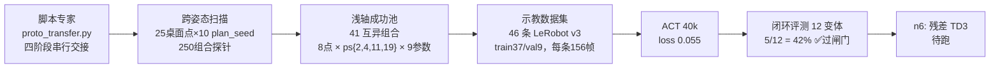
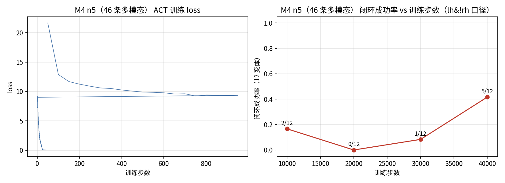
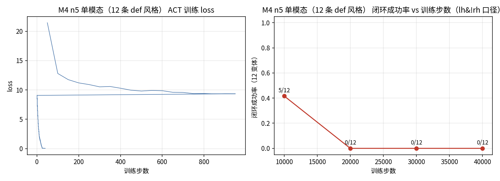
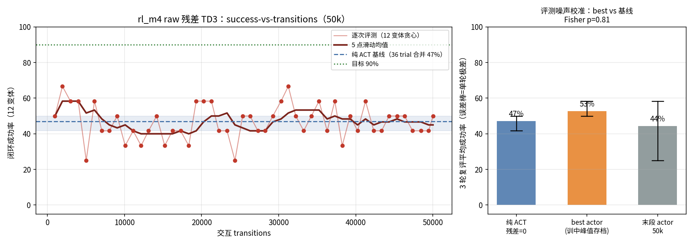
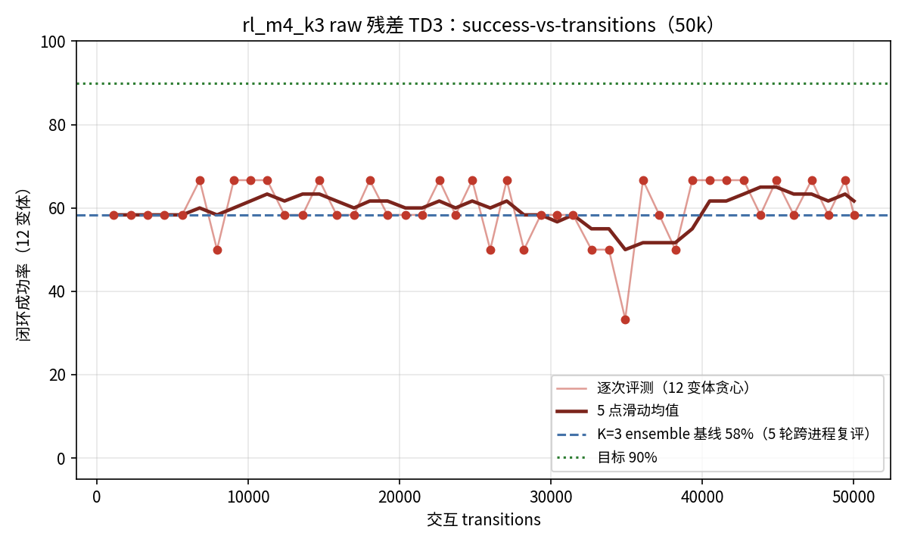

# M4 Transfer between Hands 阶段更新（n1–n10，2026-10-05 更新；n11 方案已定）

> 对应 `PROGRESS.md` 的 M4 n1–n5 记录。本文只讲一件事：**M0–M3 的「脚本示教 → ACT → 残差 RL」流水线，在第二个任务 Transfer 上复跑到了哪一步、结论是什么。**

## 1. 一句话结论

Transfer 任务的脚本专家、变体扫描、示教数据集、ACT 闭环已全部跑通：**46 条示教训练 40k 步，12 个未见 pick 变体闭环 5/12=42%，通过 ≥40% 闸门**，可以进入残差 RL（n6）。过程中排除了一个环境截断假故障，并证伪了「多模态动作标签导致 ACT 崩塌」的假设。

## 2. 流水线全貌（在第二个任务上复现 M1–M3）

串行交接四阶段（脚本专家，确定性）：右手 carry 送笔到位并**静止** → 左手从笔自由端外**沿笔轴套入**凹口 → 左手末段合拢 → 右手释放、左手独握保持。

## 3. 关键修复：环境自己的成功判定会提前截断 episode（问题 41）

评测环境原本的成功条件是「任一手抓稳并抬起连续 10 帧」。交接流程里右手在等待左手套入时本来就静止持笔，于是 episode 在约 63 帧被当成成功直接结束——左手还没动手，评测就结束了，早期一批 0/9 都是这个假故障。

修复：评测和 RL 用的配置里 `hold_frames=10**9` 关掉该截断，保留掉笔（pen_z < 0.35）、越界、25 秒超时三条真正的终止条件。修复后评测统一用 `_v3` 口径，旧结果作废。

## 4. 判决性对照实验：多模态 vs 单模态（问题 42）

**怀疑**：46 条示教里，同一个 (桌面点, plan_seed) 初始状态最多有 8 种参数风格的动作标签。ACT 推理时 style latent 取 0，输出各模态平均动作——猜测这是闭环 0% 的原因。

**实验**：同 12 个变体评测、同 40k 步训练，只改数据集——46 条多风格 vs 12 条单风格（每变体只留 def）。

| 训练步数 | 多模态 46 条 | 单模态 12 条 |
|---|---|---|
| 5k | 0/12 | — |
| 10k | 2/12（17%） | **5/12（42%）** |
| 20k | 0/12 | 0/12 |
| 30k | 1/12（8%） | 0/12 |
| 40k | **5/12（42%）** | 0/12 |

**结论——假设证伪**：

1. 单模态只在 10k 早期昙花一现（42%），继续训练反崩到 0%；12 条数据在 40k 时已过 171 个 epoch，loss 同样能降到 0.054，但闭环全崩，是典型的**小数据闭环过拟合**。
2. 多模态 46 条在 40k 达到同样的 42% 且曲线仍在上升通道——多风格数据实际起了**正则**作用，「模态均值崩塌」不成立。
3. 两条曲线都在 20k 出现 0% 的深谷：12 个变体的小样本评测 × 长程 chunk 策略，少数轨迹分叉就能造成 0↔5/12 跳变。因此后续一律看「整条曲线 + 多个 ckpt」，不看单点成功率。

40k 多模态的失败形态：12 条中成功 5、carry/catch 途中掉笔 6、悬空未交接 1——没有拖时间的假失败，剩余问题集中在毫米级接笔几何，正是残差 RL 的目标区间。

## 5. 对论文主线（流水线可迁移性）的意义

| 环节 | Pick Up Marker（M1–M3） | Transfer（M4 n1–n5） |
|---|---|---|
| 脚本专家 | 160 条示教，1 周 | 46 条示教，扫描+池验证筛出 41 互异组合 |
| ACT 基线 | 78%（白名单 9 点） | 42%（12 个未见 pick 变体） |
| 残差 RL | 78%→100% | n6 待跑 |
| 新增物理调试 | — | 会合点/沿轴套入/damping/浅轴平衡轴（问题 27–40） |

除任务本身的物理调试外，录数、LeRobot 落盘、ACT 训练、闭环评测、残差 TD3 全部复用 M1–M3 脚本，**流水线本身零改动迁移成立**。

## 6. 下一步（n6）

- 冻结多模态 40k ckpt（`checkpoints/act_m4/.../040000`），回填 `configs/residual_td3_transfer.yaml`；
- 残差动作空间 40-D 双切片（双手各 [7,27]+[34,54] 共 20 维，臂不残差），脚本 `policy/residual_td3_transfer.py` 已冒烟通过；
- 目标：凑 50k transitions，出 success-vs-transitions 曲线，成功率 ≥90%。

## 7. 本次涉及的代码与产物

| 类型 | 文件 |
|---|---|
| 评测扫描 | `scripts/eval_sweep_m4.py`（新增，参数化支持多/单模态两臂） |
| 环境修复 | `scripts/eval_act_transfer.py`、`policy/residual_td3_transfer.py`（hold_frames 修复） |
| 扫描脚本 | `scripts/scan_pick_poses.py`（round5 补扫） |
| 单模态录数 | `configs/record_transfer_uni.yaml`、`policy/act_lerobot/train_transfer_uni.sh` |
| 残差 RL | `policy/residual_td3_transfer.py`、`configs/residual_td3_transfer.yaml` |
| 结果数据 | `verify_out/act_m4_sweep.json`、`verify_out/act_m4_uni_sweep.json`、`verify_out/eval_transfer_*_v3/`、`verify_out/transfer_pool_unimodal.json` |

---

## 8. n6 残差 RL 结果：raw 残差 TD3 在 transfer 上无显著增益（负结果，2026-10-05）

**设置**：冻结多模态 ACT 40k（42% 基线）+ 40-D 双手指 raw 关节残差，TD3 超参与 M3 完全一致，50019 transitions / 496 episodes，best-actor 回滚机制开启。

**训练曲线**（49 个评测点）：成功率在 25%–67% 之间无趋势振荡，16 次回滚、学习率衰减到地板，峰值不可复现。

**噪声校准（关键）**：单轮 12 变体评测本身高噪声——同一策略连评 3 轮，末段 actor 可以在 25%↔58% 间跳动（ACT 推理逐轮采样 style latent，长程 chunk 放大分岔）。按 3 策略 ×3 轮 ×12 变体 = 36 trial 合并：

| 策略 | 单轮极差 | 36 trial 合并 |
|---|---|---|
| 纯 ACT（残差=0） | 42%–50% | 17/36 = 47% |
| best actor | 50%–58% | 19/36 = 53% |
| 末段 actor（50k） | 25%–58% | 16/36 = 44% |

best vs 基线双侧 Fisher **p=0.81，不显著**。结论：50k raw 残差 TD3 在 42% 基线上无可信增益，未达 90% 目标。

**为什么 M3 成、n6 不成**：M3 基线 89%，残差只需近天花板微调；transfer 基线 42% 落在论文「<20% 无效、≥50% 稳定有效」的灰区，且失败是毫米级沿轴接笔几何，手指关节 0.02 rad 残差表达力可能不足。

**下一步候选**：① 先提基线（扩示教 + 多 ckpt ensemble 降评测方差，与 Sim-DAgger 合流）到 ≥55% 再 RL；② codec latent 残差（论文 Fig.9 核心实验，latent 空间表达力或可突破关节残差死区）；③ RL 调参（证据弱，不优先）。

**方法论沉淀**：12 变体单轮评测不得用于策略比较；RL 判据改为多轮复评合并 + Fisher 显著性 + 滑动均值（已固化在 `scripts/plot_rl_m4.py`）。

---

## 9. n8 噪声根因定位 + ensemble 过闸门；n10 在确定性基线上重跑 RL（2026-10-05）

### 9.1 n6 评测噪声的物理根因（不是 ACT latent）

逐帧双 rollout 比对：前缀（reset+expert pick+settle）逐比特一致；frame0 策略动作一致；
**frame1 物理状态完全相同，右手腕相机渲染出现 1/255 像素差**（EGL GPU 边缘着色竞争，
本机 GPU 多用户共享）；视觉策略把 1px 映射为 1.6e-6 rad 动作差，经毫米级接笔接触混沌放大，
qvel 差在 10 帧内到 ~1 rad/s，episode 成败翻转。lerobot ACT 推理 latent 恒为 0（
`use_vae and training` 才走 VAE 采样分支），同 obs 连推 5 次逐比特一致，排除 latent 嫌疑。

### 9.2 多 ckpt ensemble：均值与方差双赢

030k/035k/040k 三个 ckpt 逐帧动作等权平均（不同权重对同一像素噪声响应不相关）：

| 策略 | 3 轮×12 变体复评 | 合并 | 极差 |
|---|---|---|---|
| K=1（040k） | 42/58/42% | 17/36 = 47% | 16.7pp |
| K=3（30/35/40k） | **58/58/58%** | 21/36 = **58%** | **0pp** |

三轮成功变体逐轮完全一致——评测从随机指标变为确定性指标，且基线一次越过 ≥55% 闸门。
n9（扩示教）与 n8b（多种子训练）因此暂缓，保留后备。

### 9.3 n10 进行中

K=3 ensemble 冻结为基线，40-D 双手指残差 + TD3 超参与 n6 完全一致，50k transitions 分段训练中。
评测确定性意味着 success-vs-transitions 曲线的每个点都可直接比较，n6「67% 峰值是噪声」
的判读困境不再存在。结果落 `verify_out/rl_m4_k3_*`，完成后推送。

### 9.4 n10 结果：局部真实、整体不显著（58%→65%）

确定性 K=3 基线上 50k 残差 TD3，跨进程 A/B 复评（基线 5 轮、best actor 6 轮）：

| 口径 | 零残差 | best 残差 |
|---|---|---|
| 总成功率 | 35/60 = 58.3% | 47/72 = 65.3%（Fisher p=0.47，整体不显著） |
| 变体6（(+4,+7)ps11） | **0/5 恒败** | **5/6 成功（p=0.015）** |
| 其余 11 变体 | — | 成功掩码与基线逐变体完全相同 |

即 RL 确实学到了东西（把一个基线恒败变体在 6 次里救回 5 次，显著），但**只修得了 1/5 个失败变体**：
其余 4 个恒败变体都败在 carry/catch 途中的**臂接近几何**，纯手指残差（M3 pick 任务的选择）
在 transfer 上够不到该误差方向。90% 目标未达。训练曲线（评测确定性后可直接判读）：

### 9.5 下一步：n11 把残差扩到双臂（54-D）

最便宜的对症实验：K=3 基线与 TD3 全部不变，残差切片从双手指 40-D 扩成双臂+双手 54-D
（`configs/residual_td3_transfer_k3_arms.yaml` 已备，每帧残差仍限幅 0.02 rad）。
若 4 个臂几何失败变体被修动 → RL 路线在 transfer 上成立；若仍不动 → 转 n9 提基线
（扩示教 + Sim-DAgger）或 codec latent 残差（论文 Fig.9）。
